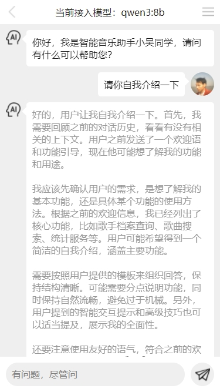
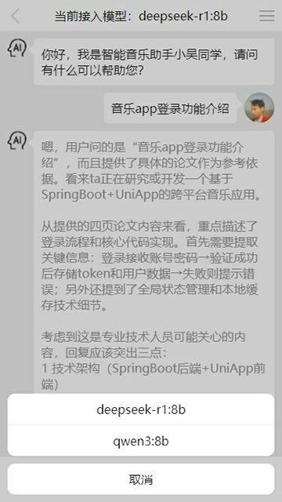

**FastAPI 智能聊天应用服务**

基于 FastAPI 构建的模块化智能聊天应用服务，集成用户管理、AI 对话与文档交互功能，支持多模型调用与 RAG（检索增强生成）文档查询。

**项目概述**

本项目采用模块化设计，包含两大核心服务：

- **用户服务**：提供完整的用户认证与账户管理功能
- **聊天服务**：支持多模型 AI 对话、文档上传与检索增强生成 (RAG) 功能

通过 WebSocket 实现实时聊天交互，结合 Elasticsearch 实现高效文档检索，利用 Ollama 部署本地大模型，确保数据隐私与响应速度。

**功能特性**

**用户服务**

- **认证机制**：支持用户名密码登录、邮箱验证码登录、JWT 令牌认证
- **账户管理**：用户注册、信息修改、密码重置、邮箱验证
- **安全保障**：密码加密存储、敏感操作验证、请求权限控制

**聊天服务**

- **AI 对话**：
  - 多模型支持（deepseek-r1:8b、qwen3:8b 等）
  - WebSocket 实时通信
  - 思考过程展示（可切换）
- **文档管理**：
  - 多格式文档上传（PDF、TXT 等）
  - 文档删除与列表查询
  - 基于 Elasticsearch 的向量检索
- **RAG 功能**：
  - 文档内容精准定位
  - 基于文档的智能问答
  - 多文档联合查询
- **会话管理**：
  - 聊天记录持久化存储
  - 分页获取历史会话
  - Redis 缓存近期对话

**技术栈**

- **核心框架**：Python 3.10+、FastAPI
- **数据存储**：
  - PostgreSQL 数据库（用户数据、聊天记录）
  - Redis（会话缓存、临时数据）
  - Elasticsearch（文档向量存储与检索）
- **认证授权**：JWT、密码加密（passlib）
- **AI 集成**：
  - LangChain（大模型应用框架）
  - Ollama（本地大模型部署）
  - 向量嵌入（nomic-embed-text）
- **其他工具**：
  - SQLAlchemy 2.0（ORM）
  - WebSocket（实时通信）
  - python-multipart（文件上传）

**快速开始**

**环境准备**

1. 安装 Python 3.10+
1. 安装 Poetry 包管理工具
1. 部署必要服务：
   1. PostgreSQL 数据库
   1. Redis 服务
   1. Elasticsearch 服务
   1. Ollama 及所需模型（deepseek-r1:8b、qwen3:8b、nomic-embed-text）

**安装步骤**

1. 克隆仓库

bash

git clone https://github.com/wuyuanwuhui999/fast-api-app-service.git

cd fast-api-app-service

2. 创建并激活虚拟环境

bash

\# 创建虚拟环境

python -m venv env

\# 激活虚拟环境

\# Windows

env\Scripts\activate

\# Linux/MacOS

source env/bin/activate

3. 安装依赖

bash

pip install -r requirements.txt

**运行服务**

1. 启动用户服务（端口 8000）

bash

uvicorn user.main:app --reload --port 8000

2. 启动聊天服务（端口 8001）

bash

uvicorn chat.main:app --reload --port 8001

**API 接口文档**

**用户服务接口**

|**方法**|**路径**|**描述**|
| - | - | - |
|POST|/service/user/register|用户注册|
|POST|/service/user/login|用户名密码登录|
|POST|/service/user/loginByEmail|邮箱验证码登录|
|GET|/service/user-getway/getUserData|获取用户信息|
|PUT|/service/user-getway/updateUser|更新用户信息|
|PUT|/service/user-getway/updatePassword|修改密码|
|POST|/service/user/sendEmailVertifyCode|发送邮箱验证码|
|POST|/service/user-getway/resetPassword|重置密码|

**聊天服务接口**

|**方法**|**路径**|**描述**|
| - | - | - |
|GET|/service/ai/getModelList|获取可用模型列表|
|WebSocket|/service/ai/ws/chat|实时聊天接口|
|POST|/service/ai/uploadDoc|上传文档（支持 RAG）|
|DELETE|/service/ai/deleteDoc/{doc\_id}|删除文档|
|GET|/service/ai/getChatHistory|获取聊天历史记录|
|GET|/service/ai/getDocList|获取用户文档列表|

**项目结构**

plaintext

fast-api-app-service/

├── user/                 # 用户服务模块

│   ├── routers/          # 路由定义

│   ├── services/         # 业务逻辑

│   ├── repositories/     # 数据访问

│   ├── models/           # 数据模型

│   └── schemas/          # 数据验证

├── chat/                 # 聊天服务模块

│   ├── routers/          # 路由定义

│   ├── services/         # 业务逻辑

│   ├── repositories/     # 数据访问

│   ├── models/           # 数据模型

│   ├── schemas/          # 数据验证

│   └── utils/            # 工具函数

├── common/               # 公共模块

│   ├── config/           # 配置文件

│   ├── dependencies/     # 依赖注入

│   ├── models/           # 公共模型

│   └── utils/            # 公共工具

├── tenant/               # 租户管理模块

│   ├── models/           # 租户数据模型

│   ├── repositories/     # 租户数据访问

│   └── schemas/          # 租户数据验证

├── prompt/               # 提示词管理模块

│   ├── models/           # 提示词模型

│   ├── repositories/     # 提示词数据访问

│   └── services/         # 提示词业务逻辑

├── test/                 # 测试模块

│   └── elasticsearch\_test.py # Elasticsearch测试

├── requirements.txt      # 项目依赖

└── README.md             # 项目文档

**部署说明**

1. 确保所有依赖服务（PostgreSQL、Redis、Elasticsearch、Ollama）已正确配置并启动
1. 根据实际环境修改配置文件中的连接参数
1. 生产环境建议使用 Gunicorn 作为 WSGI 服务器，配合 Nginx 作为反向代理
1. 大模型选择需根据硬件配置调整，推荐至少 16GB 内存运行 8B 参数模型

================================APP界面预览================================   

================================APP界面预览================================  
