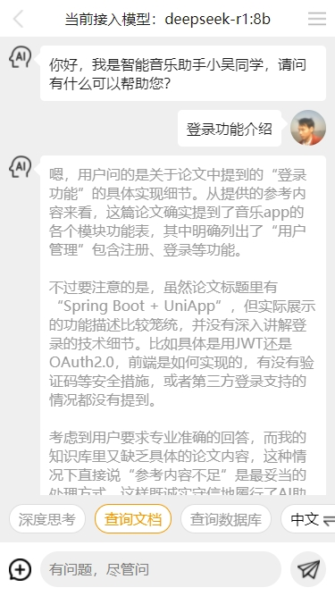
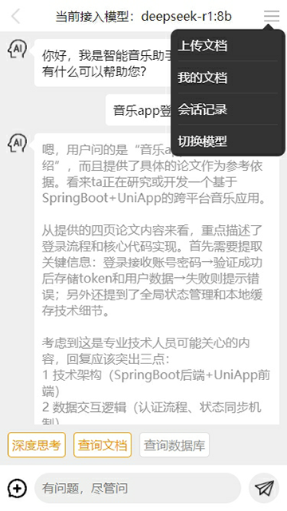

# 用户服务 (User Service)

基于FastAPI实现的用户管理微服务，提供完整的用户认证和账户管理功能。

## 功能特性

- ✅ **用户认证**
  - JWT令牌认证
  - 用户名/密码登录
  - 邮箱验证码登录
- 🔐 **账户安全**
  - 密码加密存储
  - 密码修改与重置
  - 邮箱验证流程
- 👤 **用户管理**
  - 用户注册
  - 个人信息更新
  - 头像上传
- 🛡️ **安全防护**
  - 请求认证中间件
  - 敏感操作验证
  - 账户禁用机制

## 技术栈

- 🐍 Python 3.10+
- ⚡ FastAPI 高性能框架
- 🛢️ SQLAlchemy 2.0 ORM
- 🗃️ MySQL 数据库
- 🔑 JWT 认证
- 📧 SMTP 邮件服务
- 🧩 Redis 缓存服务

## 快速开始

### 环境准备

1. 安装Python 3.10+
2. 安装Poetry包管理工具
3. 准备PostgreSQL数据库
4. 准备Redis服务

### 创建虚拟环境
python -m venv env

### 激活虚拟环境
env\Scripts\activate

### 安装依赖
pip install -r requirements.txt

###运行命令
uvicorn user.main:app --reload   

================================APP界面预览================================   

================================APP界面预览================================  
